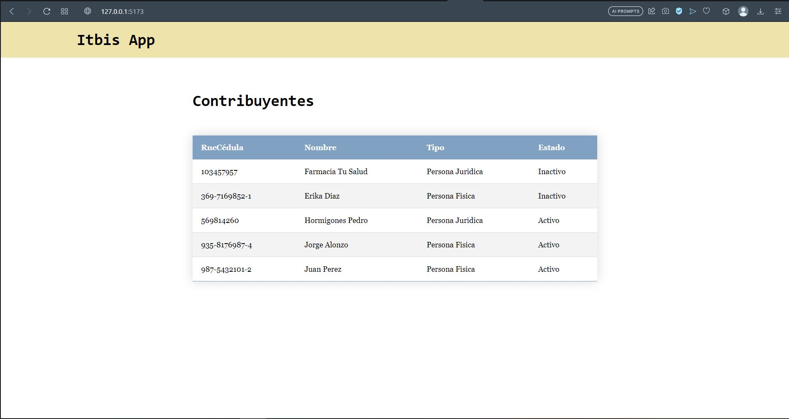
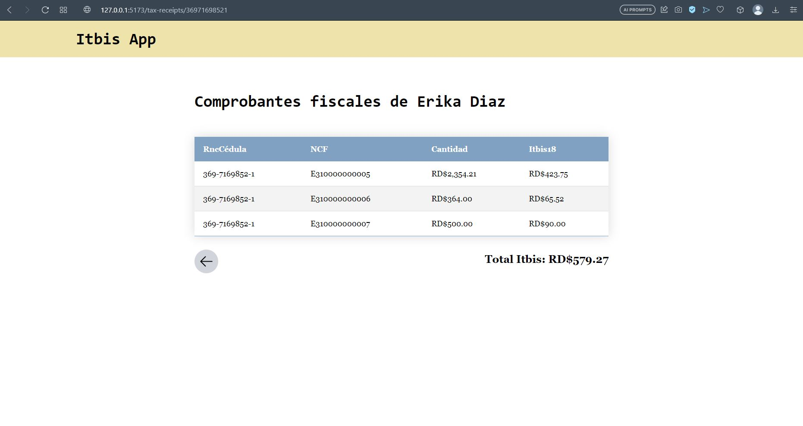
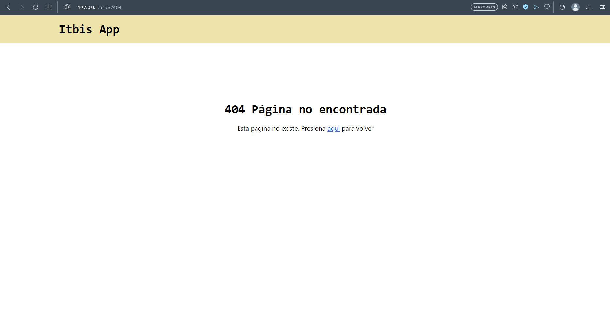
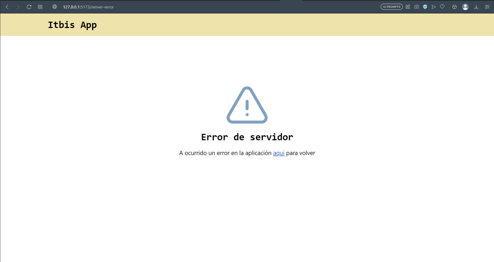
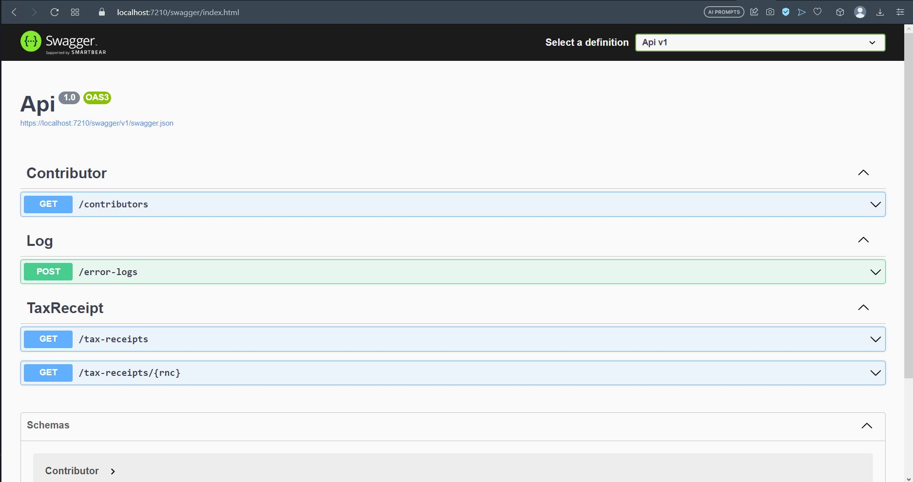

# Itbis app

## Descripción del proyecto

La estructura de la aplicación esta dividida entre frontend y backend. El frontend contiene el cliente,
el cual esta escrito en React junto con TailwindCSS y Vite como build tool. En el caso del backend este se compone 
de dos proyectos — Api y Api.UnitTests —. Api hace uso de EntityFrameworkCore como ORM y Serilog para logging, mientras que Api.UnitTests hace uso de xUnit y Moq para los tests. Ambos proyectos usan **.NET 6**. 

## Como correr el proyecto

El backend se conecta a una base de datos SQL de Azure que ya esta en la nube, por lo tanto, solo
hace falta correr la api y el cliente.

Para subir el backend vamos al directorio Backend/Api, instalamos las dependencias y comenzamos el proyecto

```console
cd Backend/Api
dotnet run
```

Al subir la api se debe navegar a https://localhost:7210/swagger para poder ver las rutas disponibles.

Una vez el backend este arriba, abrimos otra consola, navegamos al 
frontend e instalamos las dependencias antes de correr la app

```console
cd ../../Frontend/WebApp
yarn install
yarn dev
```

## Ejecutar tests

Para correr los tests del backend solo hace falta ir al directio Backend/Api.UnitTests y usar el comando dotnet test

```console
cd Backend/Api.UnitTests
dotnet test
```

## Imágenes






### Rutas de la api

